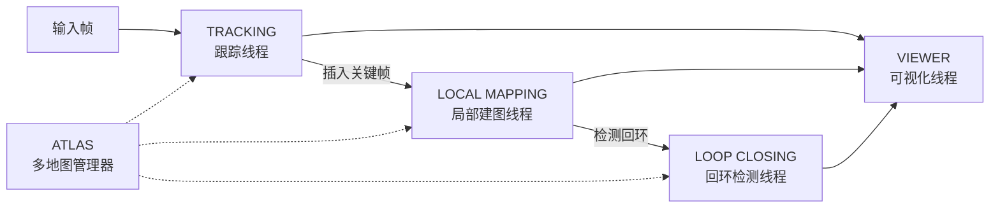
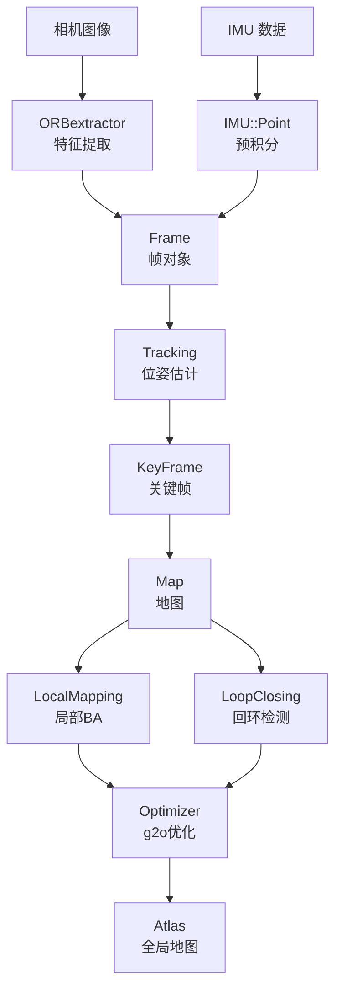

# ORB-SLAM3 快速入门指南

> **版本**: V1.0 (2021.12.22) | **作者**: Carlos Campos, Richard Elvira, Juan J. Gómez Rodríguez, José M. M. Montiel, Juan D. Tardós  
> **论文**: [ORB-SLAM3: An Accurate Open-Source Library for Visual, Visual-Inertial and Multi-Map SLAM](https://arxiv.org/abs/2007.11898), *IEEE TRO 2021*

---

## 目录

- [1. 项目概述](#1-项目概述)
- [2. 目录结构一览](#2-目录结构一览)
- [3. 环境依赖](#3-环境依赖)
- [4. 编译构建](#4-编译构建)
- [5. 传感器配置与模式](#5-传感器配置与模式)
- [6. 运行示例](#6-运行示例)
- [7. 核心架构详解](#7-核心架构详解)
- [8. 配置文件说明](#8-配置文件说明)
- [9. 评估工具](#9-评估工具)
- [10. 常用工作流](#10-常用工作流)
- [11. 相关论文](#11-相关论文)

---

## 1. 项目概述

ORB-SLAM3 是**首个**同时支持 **纯视觉**、**视觉-惯性** 和 **多地图** SLAM 的实时开源库，支持的传感器配置包括：

| 传感器模式 | 相机类型 | 惯性(IMU) |
|:---|:---|:---:|
| **MONOCULAR** (单目) | 针孔 / 鱼眼 | ✗ |
| **STEREO** (双目) | 针孔 / 鱼眼 | ✗ |
| **RGB-D** (深度) | 针孔 | ✗ |
| **IMU_MONOCULAR** (单目+IMU) | 针孔 / 鱼眼 | ✓ |
| **IMU_STEREO** (双目+IMU) | 针孔 / 鱼眼 | ✓ |
| **IMU_RGBD** (RGB-D+IMU) | 针孔 | ✓ |

### 核心特性

1. **多地图系统 (Atlas)**: 跟踪丢失后可自动创建新地图，当检测到已访问区域时无缝融合多个子地图
2. **视觉-惯性紧耦合**: IMU 初始化仅需 2 秒达到 5% 尺度误差，10 秒内收敛至 1%
3. **鱼眼相机支持**: 完全支持广角和鱼眼镜头模型 (KannalaBrandt8)
4. **地图保存/加载**: 支持会话地图的序列化存储与恢复
5. **在线标定**: 支持 RealSense D435i/T265 等相机

---

## 2. 目录结构一览

```
ORB_SLAM3/
├── build.sh                  # 一键编译脚本（Thirdparty + ORB_SLAM3 主库）
├── build_ros.sh              # ROS 节点编译脚本
├── CMakeLists.txt            # CMake 构建配置
├── Dependencies.md           # 依赖库及许可证说明
├── Changelog.md              # 版本更新日志
│
├── include/                  # 头文件（核心 API 定义）
│   ├── System.h              # ★ 系统主入口
│   ├── Tracking.h            # 跟踪线程
│   ├── LocalMapping.h        # 局部建图线程
│   ├── LoopClosing.h         # 回环检测与融合
│   ├── Atlas.h               # 多地图管理器
│   ├── Map.h / MapPoint.h    # 地图与地图点
│   ├── KeyFrame.h / Frame.h  # 关键帧与普通帧
│   ├── ORBextractor.h        # ORB 特征提取器
│   ├── ORBmatcher.h          # 特征匹配
│   ├── Optimizer.h           # 图优化 (g2o)
│   ├── ImuTypes.h            # IMU 数据类型
│   ├── Converter.h           # 类型转换工具
│   ├── Viewer.h / FrameDrawer.h / MapDrawer.h  # 可视化
│   ├── Settings.h / Config.h # 配置解析
│   └── CameraModels/         # 相机模型
│       ├── GeometricCamera.h # 相机基类
│       ├── Pinhole.h         # 针孔模型
│       └── KannalaBrandt8.h  # 鱼眼模型
│
├── src/                      # 源文件（与头文件一一对应）
│   ├── System.cc             # 系统初始化与主循环
│   ├── Tracking.cc           # 跟踪核心（前端里程计）
│   ├── LocalMapping.cc       # 局部 BA 与关键帧管理
│   ├── LoopClosing.cc        # 回环检测/校正/融合
│   ├── Atlas.cc              # 多地图管理
│   ├── ORBextractor.cc       # ORB 特征提取（改进自 OpenCV）
│   ├── Optimizer.cc          # g2o 图优化封装
│   ├── Map.cc / MapPoint.cc / KeyFrame.cc / Frame.cc # 数据元素
│   └── CameraModels/         # 相机模型实现
│
├── Examples/                 # ★ 各传感器配置的示例程序
│   ├── Monocular/            # 单目示例 (EuRoC/KITTI/TUM/RealSense)
│   ├── Monocular-Inertial/   # 单目+IMU 示例
│   ├── Stereo/               # 双目示例
│   ├── Stereo-Inertial/      # 双目+IMU 示例
│   ├── RGB-D/                # RGB-D 示例 (TUM/RealSense)
│   ├── RGB-D-Inertial/       # RGB-D+IMU 示例
│   └── Calibration/          # 相机录制工具
│
├── Thirdparty/               # 第三方依赖（已包含）
│   ├── DBoW2/                # 词袋模型 - 地点识别
│   ├── g2o/                  # 图优化 - 非线性优化
│   └── Sophus/               # 李群/李代数
│
├── Vocabulary/               # ORB 词袋词汇表
│   └── ORBvoc.txt.tar.gz     # 需要解压 (build.sh 自动处理)
│
└── evaluation/               # 评估脚本
    ├── evaluate_ate_scale.py # 绝对轨迹误差(ATE) + 自动尺度对齐
    ├── associate.py          # 时间戳关联工具
    └── Ground_truth/         # EuRoC 数据集真值
```

---

## 3. 环境依赖

| 依赖 | 最低版本 | 用途 | 安装方式 |
|:---|:---|:---|:---|
| **C++11** | - | 编译标准 | 系统自带 |
| **Pangolin** | 最新 | 3D 可视化与用户界面 | [`stevenlovegrove/Pangolin`](https://github.com/stevenlovegrove/Pangolin) |
| **OpenCV** | ≥ 3.0 (推荐 4.4) | 图像处理与特征操作 | `apt install libopencv-dev` |
| **Eigen3** | ≥ 3.1.0 | 矩阵运算 (g2o 依赖) | `apt install libeigen3-dev` |
| **DBoW2** | *(已内置)* | 词袋模型地点识别 | Thirdparty 目录 |
| **g2o** | *(已内置)* | 非线性图优化 | Thirdparty 目录 |
| **Sophus** | *(已内置)* | 李群 SE3 运算 | Thirdparty 目录 |
| **Python + NumPy** | 2.7/3.x | 轨迹评估工具 | `apt install python3-numpy` |
| **ROS** (可选) | Melodic | ROS 集成 | `apt install ros-melodic-desktop-full` |
| **librealsense2** (可选) | 2.x | Intel RealSense 相机 | [IntelRealSense/librealsense](https://github.com/IntelRealSense/librealsense) |
| **Boost Serialization** | - | 地图序列化 | 系统自带 |
| **OpenSSL (libcrypto)** | - | 校验和计算 | 系统自带 |

### Ubuntu 18.04 快速安装依赖

```bash
# 基础依赖
sudo apt install -y cmake gcc g++ git libeigen3-dev libopencv-dev \
    python3 python3-numpy libboost-serialization-dev libssl-dev

# Pangolin (可视化)
git clone https://github.com/stevenlovegrove/Pangolin.git
cd Pangolin && mkdir build && cd build
cmake .. && make -j$(nproc) && sudo make install
cd ../..

# ROS (可选)
sudo apt install -y ros-melodic-desktop-full
```

---

## 4. 编译构建

### 4.1 标准编译（非 ROS）

```bash
cd ORB_SLAM3
chmod +x build.sh
./build.sh
```

`build.sh` 脚本自动执行以下步骤：
1. 编译 `Thirdparty/DBoW2`（词袋库）
2. 编译 `Thirdparty/g2o`（图优化）
3. 编译 `Thirdparty/Sophus`（李代数）
4. 解压 `Vocabulary/ORBvoc.txt.tar.gz`
5. 编译 ORB_SLAM3 主库 → 生成 **`lib/libORB_SLAM3.so`**
6. 编译所有示例可执行文件 → 生成在 `Examples/*/` 各子目录下

### 4.2 ROS 编译

```bash
# 1. 配置 ROS 环境
echo "export ROS_PACKAGE_PATH=\${ROS_PACKAGE_PATH}:$(pwd)/Examples/ROS" >> ~/.bashrc
source ~/.bashrc

# 2. 编译 ROS 节点
chmod +x build_ros.sh
./build_ros.sh
```

### 4.3 编译产物

| 产物 | 路径 | 说明 |
|:---|:---|:---|
| `libORB_SLAM3.so` | `lib/` | ORB-SLAM3 动态库 |
| `mono_euroc` 等 | `Examples/Monocular/` | 单目示例程序 |
| `mono_inertial_euroc` 等 | `Examples/Monocular-Inertial/` | 单目+IMU 示例 |
| `stereo_euroc` 等 | `Examples/Stereo/` | 双目示例 |
| `stereo_inertial_euroc` 等 | `Examples/Stereo-Inertial/` | 双目+IMU 示例 |
| `rgbd_tum` 等 | `Examples/RGB-D/` | RGB-D 示例 |
| `rgbd_inertial_realsense_D435i` | `Examples/RGB-D-Inertial/` | RGB-D+IMU 示例 |

> **注意**: RealSense 相关示例仅在检测到 librealsense2 时编译。KITTI 相关示例仅在 OpenCV < 4.4 时编译。

---

## 5. 传感器配置与模式

ORB-SLAM3 通过 `System::eSensor` 枚举定义了 **6 种传感器模式**：

```cpp
enum eSensor {
    MONOCULAR     = 0,  // 单目
    STEREO        = 1,  // 双目 (需要标定外参)
    RGBD          = 2,  // RGB-D (深度对齐到彩色)
    IMU_MONOCULAR = 3,  // 单目 + IMU
    IMU_STEREO    = 4,  // 双目 + IMU
    IMU_RGBD      = 5,  // RGB-D + IMU
};
```

### 关键 API

```cpp
// 1. 创建 SLAM 系统
ORB_SLAM3::System SLAM(vocabPath, settingsPath, sensorType, useViewer);

// 2. 处理一帧图像（三种重载）
SLAM.TrackMonocular(im, timestamp, vImuMeas);       // 单目
SLAM.TrackStereo(imLeft, imRight, timestamp, vImuMeas); // 双目
SLAM.TrackRGBD(im, depthmap, timestamp, vImuMeas);   // RGB-D

// 3. 系统控制
SLAM.ActivateLocalizationMode();    // 纯定位模式（暂停建图）
SLAM.DeactivateLocalizationMode();  // 恢复建图
SLAM.Shutdown();                    // 关闭系统

// 4. 轨迹保存
SLAM.SaveTrajectoryTUM("traj.txt");       // TUM 格式
SLAM.SaveTrajectoryEuRoC("traj.txt");     // EuRoC 格式
SLAM.SaveTrajectoryKITTI("traj.txt");     // KITTI 格式
SLAM.SaveKeyFrameTrajectoryTUM("kf.txt"); // 关键帧轨迹
```

---

## 6. 运行示例

### 6.1 EuRoC 数据集

EuRoC 是微型飞行器数据集，包含针孔双目相机和 IMU 传感器。

```bash
# 下载数据集后，修改 euroc_examples.sh 中的路径变量
# 单目模式
./Examples/Monocular/mono_euroc Vocabulary/ORBvoc.txt \
    Examples/Monocular/EuRoC.yaml \
    PATH_TO_SEQUENCE/mav0/cam0/data \
    Examples/Monocular/EuRoC_TimeStamps/MH01.txt

# 单目+IMU 模式
./Examples/Monocular-Inertial/mono_inertial_euroc Vocabulary/ORBvoc.txt \
    Examples/Monocular-Inertial/EuRoC.yaml \
    PATH_TO_SEQUENCE PATH_TO_SEQUENCE/mav0/cam0/data \
    Examples/Monocular/EuRoC_TimeStamps/MH01.txt

# 双目模式
./Examples/Stereo/stereo_euroc Vocabulary/ORBvoc.txt \
    Examples/Stereo/EuRoC.yaml \
    PATH_TO_SEQUENCE \
    Examples/Stereo/EuRoC_TimeStamps/MH01.txt

# 双目+IMU 模式
./Examples/Stereo-Inertial/stereo_inertial_euroc Vocabulary/ORBvoc.txt \
    Examples/Stereo-Inertial/EuRoC.yaml \
    PATH_TO_SEQUENCE \
    Examples/Stereo/EuRoC_TimeStamps/MH01.txt
```

### 6.2 TUM RGB-D 数据集

```bash
# RGB-D 模式（需要 associate.py 关联 color/depth 时间戳）
./Examples/RGB-D/rgbd_tum Vocabulary/ORBvoc.txt \
    Examples/RGB-D/TUM1.yaml \
    PATH_TO_SEQUENCE \
    Examples/RGB-D/associations/fr1_xyz.txt
```

### 6.3 KITTI 数据集

```bash
# 单目模式
./Examples/Monocular/mono_kitti Vocabulary/ORBvoc.txt \
    Examples/Monocular/KITTI00-02.yaml PATH_TO_KITTI/00

# 双目模式
./Examples/Stereo/stereo_kitti Vocabulary/ORBvoc.txt \
    Examples/Stereo/KITTI00-02.yaml PATH_TO_KITTI/00
```

### 6.4 TUM-VI 数据集（鱼眼相机）

```bash
# 单目+IMU 鱼眼模式
./Examples/Monocular-Inertial/mono_inertial_tum_vi Vocabulary/ORBvoc.txt \
    Examples/Monocular-Inertial/TUM-VI.yaml \
    PATH_TO_DATASET/dataset-corridor1_512_16/mav0/cam0/data \
    Examples/Monocular-Inertial/TUM_TimeStamps/dataset-corridor1_512.txt \
    PATH_TO_DATASET/dataset-corridor1_512/mav0/imu0/data.csv
```

### 6.5 RealSense D435i 实时运行

```bash
# 单目模式
./Examples/Monocular/mono_realsense_D435i Vocabulary/ORBvoc.txt \
    Examples/Monocular/RealSense_D435i.yaml

# 单目+IMU 模式
./Examples/Monocular-Inertial/mono_inertial_realsense_D435i Vocabulary/ORBvoc.txt \
    Examples/Monocular-Inertial/RealSense_D435i.yaml

# 双目+IMU 模式
./Examples/Stereo-Inertial/stereo_inertial_realsense_D435i Vocabulary/ORBvoc.txt \
    Examples/Stereo-Inertial/RealSense_D435i.yaml
```

---

## 7. 核心架构详解

### 7.1 三线程并行架构

ORB-SLAM3 采用经典的**三线程并行**设计，每个线程独立运行：



#### Tracking（跟踪线程）— 前端
- **职责**: 每帧定位相机位姿
- **核心流程**: ORB 特征提取 → 运动模型/参考关键帧跟踪 → 局部地图跟踪 → 关键帧决策
- **重定位**: 跟踪丢失时利用词袋模型进行全局重定位
- **IMU 集成**: 在视觉-惯性模式下，利用 IMU 预积分约束辅助跟踪

#### Local Mapping（局部建图线程）— 后端
- **职责**: 管理关键帧和地图点
- **核心流程**: 插入关键帧 → 地图点剔除 → 新地图点创建 → 局部 BA 优化 → 冗余关键帧剔除
- **IMU 初始化**: 处理视觉-惯性初始化（MAP 估计 + 视觉-惯性 BA）

#### Loop Closing（回环检测/融合线程）
- **职责**: 检测回环、校正漂移、地图融合
- **核心流程**: 词袋查询 → Sim3 计算 → 回环校正 → 本质图优化 → 全局 BA
- **地图融合**: 多地图模式下，检测到公共区域时自动融合两个子地图（Welding BA）

### 7.2 多地图系统 (Atlas)

```
Atlas (多地图管理器)
├── Map 0 (活跃地图)        ← 当前跟踪使用
│   ├── KeyFrames
│   └── MapPoints
├── Map 1 (失活地图)        ← 跟踪丢失时自动创建
│   ├── KeyFrames
│   └── MapPoints
└── Map N ...
    └── ...
```

- **自动创建**: 跟踪丢失时，系统自动创建新地图继续运行（不中断）
- **地图融合**: 回环检测模块检测到公共区域时，将两个地图无缝拼接
- **序列化**: 支持整张 Atlas（所有地图）的保存与加载 (Boost.Serialization)

### 7.3 相机模型

| 相机模型 | 类名 | 适用场景 |
|:---|:---|:---|
| **针孔 (Pinhole)** | `Pinhole` | 普通相机、EuRoC、KITTI、TUM |
| **鱼眼 (KannalaBrandt)** | `KannalaBrandt8` | TUM-VI、广角/鱼眼镜头 |

```cpp
// 基类 (include/CameraModels/GeometricCamera.h)
class GeometricCamera {
    virtual cv::Point2f project(const cv::Point3f &p3D) = 0;
    virtual Eigen::Vector2f project(const Eigen::Vector3f &v3D) = 0;
    virtual cv::Point3f unproject(const cv::Point2f &p2D) = 0;
    // ...
};
```

### 7.4 数据流总览



---

## 8. 配置文件说明

配置文件为 YAML 格式，分为以下几个区块：

### 8.1 文件版本与系统配置

```yaml
File.version: "1.0"

# 从已保存的 Atlas 恢复（不存在则创建新地图）
#System.LoadAtlasFromFile: "Session_MH01_Mono"

# 保存当前 Atlas 到文件
#System.SaveAtlasToFile: "Session_MH01_Mono"
```

### 8.2 相机参数（针孔模型）

```yaml
Camera.type: "PinHole"    # 或 "KannalaBrandt8"

Camera1.fx: 458.654       # 焦距 x
Camera1.fy: 457.296       # 焦距 y
Camera1.cx: 367.215       # 光心 x
Camera1.cy: 248.375       # 光心 y

Camera1.k1: -0.28340811   # 径向畸变 k1
Camera1.k2: 0.07395907    # 径向畸变 k2
Camera1.p1: 0.00019359    # 切向畸变 p1
Camera1.p2: 1.76187114e-05 # 切向畸变 p2

Camera.width: 752         # 图像宽度
Camera.height: 480        # 图像高度
Camera.fps: 20            # 帧率
Camera.RGB: 1             # 色彩顺序 (0:BGR, 1:RGB)

# 可选：图像缩放
Camera.newWidth: 600      # 缩放后宽度（无此项则不缩放）
Camera.newHeight: 350     # 缩放后高度
```

### 8.3 双目外参（仅双目模式）

```yaml
Stereo.ThDepth: 60.0      # 双目深度阈值（基线倍数）

# 左相机到右相机的变换矩阵 (4x4)
Stereo.T_c1_c2: !!opencv-matrix
  rows: 4
  cols: 4
  dt: f
  data: [0.999997, -0.002317, -0.000343, 0.110074, ...]
```

### 8.4 IMU 参数（仅惯性模式）

```yaml
# 相机到 IMU 的外参 (T_body_cam)
IMU.T_b_c1: !!opencv-matrix
  rows: 4
  cols: 4
  dt: f
  data: [0.0148655, -0.999881, 0.0041403, -0.0216401, ...]

# IMU 噪声参数
IMU.NoiseGyro: 1.7e-4      # 陀螺仪噪声密度
IMU.NoiseAcc: 2.0000e-3    # 加速度计噪声密度
IMU.GyroWalk: 1.9393e-05   # 陀螺仪随机游走
IMU.AccWalk: 3.0000e-03    # 加速度计随机游走
IMU.Frequency: 200.0       # IMU 频率 (Hz)
```

### 8.5 ORB 特征参数

```yaml
ORBextractor.nFeatures: 1000    # 每帧提取特征点数
ORBextractor.scaleFactor: 1.2   # 金字塔缩放因子
ORBextractor.nLevels: 8         # 金字塔层数
ORBextractor.iniThFAST: 20      # FAST 初始阈值
ORBextractor.minThFAST: 7       # FAST 最低阈值
```

### 8.6 可视化参数

```yaml
Viewer.KeyFrameSize: 0.05       # 关键帧显示大小
Viewer.KeyFrameLineWidth: 1.0   # 关键帧线宽
Viewer.GraphLineWidth: 0.9      # 共视图线宽
Viewer.PointSize: 2.0           # 地图点大小
Viewer.CameraSize: 0.08         # 相机模型大小
Viewer.CameraLineWidth: 3.0     # 相机模型线宽
Viewer.ViewpointX: 0.0          # 视角位置 X
Viewer.ViewpointY: -0.7         # 视角位置 Y
Viewer.ViewpointZ: -1.8         # 视角位置 Z
Viewer.ViewpointF: 500.0        # 视角焦距
```

---

## 9. 评估工具

### 9.1 绝对轨迹误差 (ATE)

```bash
# 计算 ATE（自动估计尺度对齐，适用于单目）
python3 evaluation/evaluate_ate_scale.py \
    ground_truth.txt \
    estimated_trajectory.txt \
    --plot result.png \
    --verbose
```

- **`evaluate_ate_scale.py`**: 计算 ATE 的 RMSE，并自动估计最优尺度对齐（适用于单目 SLAM）
- **`associate.py`**: 时间戳匹配工具（RGB-D 数据中关联 color 和 depth 帧）

### 9.2 评估脚本示例

```bash
# EuRoC 批量评估
./euroc_eval_examples

# TUM-VI 批量评估
./tum_vi_eval_examples
```

### 9.3 轨迹格式

| 格式 | 适用场景 | 格式说明 |
|:---|:---|:---|
| **TUM** | RGB-D, 单目 | `timestamp tx ty tz qx qy qz qw` |
| **EuRoC** | EuRoC 数据集 | `timestamp tx ty tz qw qx qy qz` |
| **KITTI** | KITTI 数据集 | 3×4 位姿矩阵（每行） |

---

## 10. 常用工作流

### 10.1 首次使用完整流程

```bash
# 步骤1：安装依赖
sudo apt install -y cmake g++ git libeigen3-dev libopencv-dev \
    python3-numpy libboost-serialization-dev libssl-dev

# 步骤2：安装 Pangolin
git clone https://github.com/stevenlovegrove/Pangolin.git
cd Pangolin && mkdir build && cd build
cmake .. && make -j$(nproc) && sudo make install
cd ../..

# 步骤3：克隆并编译 ORB-SLAM3
git clone https://github.com/UZ-SLAMLab/ORB_SLAM3.git
cd ORB_SLAM3
chmod +x build.sh && ./build.sh

# 步骤4：下载 EuRoC MH01 序列测试
# 访问 http://projects.asl.ethz.ch/datasets/ 下载

# 步骤5：运行单目测试
./Examples/Monocular/mono_euroc Vocabulary/ORBvoc.txt \
    Examples/Monocular/EuRoC.yaml \
    PATH_TO_EuRoC/MH01/mav0/cam0/data \
    Examples/Monocular/EuRoC_TimeStamps/MH01.txt
```

### 10.2 使用自己的相机

1. **标定相机**: 按照 `Examples/Calibration/` 中的教程和工具录制标定数据
2. **编写 YAML 配置文件**: 参照 `Examples/*/EuRoC.yaml` 等模板，填入标定参数
3. **选择示例修改**: 复制最近的示例程序（如 `mono_euroc.cc`），修改数据读取逻辑
4. **添加 CMakeLists.txt**: 如需编译自己的可执行文件，参照现有示例添加构建规则

### 10.3 地图保存与加载

```yaml
# 在配置文件中设置
System.SaveAtlasToFile: "my_session"    # 保存地图
System.LoadAtlasFromFile: "my_session"  # 加载地图
```

系统会在程序退出时自动保存，下次启动时自动加载。

### 10.4 ROS 使用

```bash
# 启动单目 ROS 节点
rosrun ORB_SLAM3 Mono Vocabulary/ORBvoc.txt Examples/Monocular/EuRoC.yaml

# 启动单目+IMU ROS 节点
rosrun ORB_SLAM3 Mono_Inertial Vocabulary/ORBvoc.txt \
    Examples/Monocular-Inertial/EuRoC.yaml [EQUALIZATION]

# 启动双目 ROS 节点
rosrun ORB_SLAM3 Stereo Vocabulary/ORBvoc.txt \
    Examples/Stereo/EuRoC.yaml ONLINE_RECTIFICATION
```

ROS 节点订阅的 Topic:
| 节点 | 订阅 Topic |
|:---|:---|
| `Mono` | `/camera/image_raw` |
| `Mono_Inertial` | `/camera/image_raw` + `/imu` |
| `Stereo` | `/camera/left/image_raw` + `/camera/right/image_raw` |
| `Stereo_Inertial` | `/camera/left/image_raw` + `/camera/right/image_raw` + `/imu` |

---

## 11. 相关论文

| 论文 | 说明 |
|:---|:---|
| [ORB-SLAM3 (TRO 2021)](https://arxiv.org/abs/2007.11898) | ★ 主论文：视觉、视觉-惯性、多地图 SLAM |
| [IMU Initialization (ICRA 2020)](https://arxiv.org/pdf/2003.05766.pdf) | 仅惯性优化的视觉-惯性初始化 |
| [ORBSLAM-Atlas (IROS 2019)](https://arxiv.org/pdf/1908.11585.pdf) | 鲁棒精确的多地图系统 |
| [ORBSLAM-VI (RA-L 2017)](https://arxiv.org/pdf/1610.05949.pdf) | 视觉-惯性单目 SLAM 与地图复用 |
| [ORB-SLAM2 (TRO 2017)](https://arxiv.org/pdf/1610.06475.pdf) | 双目与 RGB-D SLAM |
| [ORB-SLAM (TRO 2015)](https://arxiv.org/pdf/1502.00956.pdf) | 单目 SLAM（2015 TRO 最佳论文） |
| [DBoW2 (TRO 2012)](http://doriangalvez.com/php/dl.php?dlp=GalvezTRO12.pdf) | 二进制词袋快速地点识别 |

---

> **提示**: 更详细的 API 参考请参阅 `include/` 下的头文件注释，标定教程请参阅 `Examples/Calibration/` 目录。

---

## 12. 使用 RealSense D435i 实时运行

> 完整指南: 请参阅 [`docs/D435i_使用指南.md`](D435i_使用指南.md)

ORB-SLAM3 **已内置** Intel RealSense D435i 的配置文件和示例程序，编译后即可直接运行，无需额外标定。

### 快速三步上手

```bash
# 步骤1：确保 librealsense2 已安装，然后编译 ORB-SLAM3
chmod +x build.sh && ./build.sh

# 步骤2：直接运行 RGB-D 模式（最简单，推荐入门）
./Examples/RGB-D/rgbd_realsense_D435i \
    Vocabulary/ORBvoc.txt \
    Examples/RGB-D/RealSense_D435i.yaml

# 步骤3：体验双目+IMU 模式（精度最高）
./Examples/Stereo-Inertial/stereo_inertial_realsense_D435i \
    Vocabulary/ORBvoc.txt \
    Examples/Stereo-Inertial/RealSense_D435i.yaml
```

### D435i 已内置的可运行模式

| 推荐顺序 | 模式 | 可执行文件 | 配置文件 |
|:---:|:---|:---|:---|
| 1 | RGB-D | `Examples/RGB-D/rgbd_realsense_D435i` | `Examples/RGB-D/RealSense_D435i.yaml` |
| 2 | 双目+IMU | `Examples/Stereo-Inertial/stereo_inertial_realsense_D435i` | `Examples/Stereo-Inertial/RealSense_D435i.yaml` |
| 3 | RGB-D+IMU | `Examples/RGB-D-Inertial/rgbd_inertial_realsense_D435i` | `Examples/RGB-D-Inertial/RealSense_D435i.yaml` |
| 4 | 双目 | `Examples/Stereo/stereo_realsense_D435i` | `Examples/Stereo/RealSense_D435i.yaml` |
| 5 | 单目+IMU | `Examples/Monocular-Inertial/mono_inertial_realsense_D435i` | `Examples/Monocular-Inertial/RealSense_D435i.yaml` |
| 6 | 单目 | `Examples/Monocular/mono_realsense_D435i` | `Examples/Monocular/RealSense_D435i.yaml` |

### D435i 关键参数

| 参数 | 值 |
|:---|:---|
| 深度基线 | 50mm |
| RGB 传感器 | Rolling Shutter |
| IMU | BMI055 (6-DoF) |
| 推荐深度范围 | 0.3m ~ 3m |
| SDK | librealsense2 |

详细步骤、常见问题和调试技巧请阅读 [`docs/D435i_使用指南.md`](D435i_使用指南.md)。
